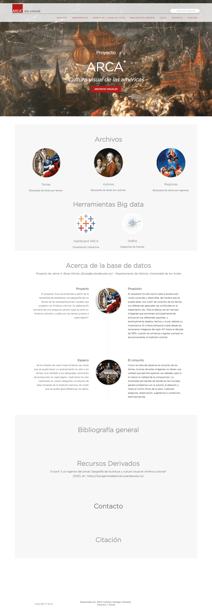

# Arca versión 1: Ruby, Rails y Postgres

Esta es la primera versión del sitio web de Arca desarrollado en Ruby on Rails.
Para mantener un backup completo y funcional, se ha creado un contenedor de Docker que se puede correr de manera local o subirlo a un nuevo servidor.

## Instalación

### Docker

Instalar docker https://docs.docker.com/get-docker/

### Crear imagen de Docker

En el terminal, ir a la carpeta donde se guardaron los archivos que acompañan este documento.

Primero tenemos que crear una imagen de Docker con la versión de Ruby que necesita la aplicación (Ejecuta las instrucciones del archivo `./Dockerfile`). Este paso sólo es necesario en una instalación nueva:

```sh
docker build -t arcav1-ruby:latest .
```

_Si se hacen cambios al `Gemfile` o `Dockerfile` se debe volver a correr este comando. Pero como esto es un backup y se asume que no tiene más desarrollo, es probable que sólo se tenga que correr en el proceso de instalación._

## Iniciar contenedor

Ya con todo instalado simplemente hay que correr el siguiente comando para iniciar la aplicación localmente.

```sh
docker-compose up -d
```

**El sitio se puede ver en [localhost:8080](http://localhost:8080)**

## Apagar contenedor

```sh
docker-compose down
```

### En Linux

Si sale un error de `Permission Denied` en la carpeta `postgres_datos`:

```zsh
sudo chown -R 1000:1000 postgres_datos
```


